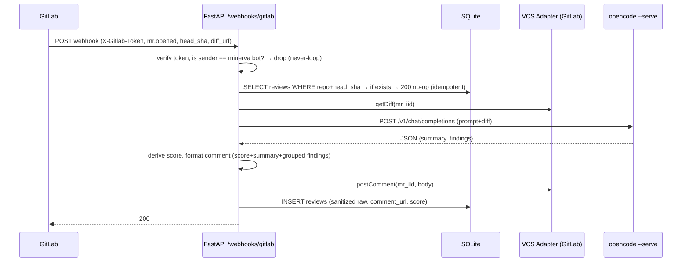

# Minerva — Architecture

> Companion to `project.md` + `guardrails.md`. All paths relative to repo root.

## 1. Overview

Minerva is a **3-tier, local-first, VCS-agnostic** review platform:

```
[GitLab CE (docker)] --webhook--> [FastAPI] --OpenAI compat--> [opencode --serve]
      ^                                |
      | post comment                   v
      +-----------[React Dashboard] [SQLite + Alembic]
                      (Vite)
```

*   **Hot path (review):** Webhook → verify → idempotency check → fetch diff via VCS Adapter → call LLM → score → post comment → persist audit row. This path **must not require cloud** and **must fail quietly** if LLM/DB unavailable.
*   **Control path (dashboard):** Auth → Org/VCS/Repo CRUD → assign users → browse reviews.

## 2. Component Map

| Component | Responsibility | Key Files (target) |
|---|---|---|
| **VCS Adapter** | Abstraction over GitLab/GitHub. Methods: `getMR, getDiff, listRepos, postComment, getFile`. GitLab impl uses `python-gitlab` or REST. | `api/app/vcs/base.py`, `api/app/vcs/gitlab.py`, `api/app/vcs/github.py` (stub) |
| **Webhook Handler** | Verify `X-Gitlab-Token`, ignore bot, check `head_sha`, enqueue review. Idempotency + never-loop. | `api/app/routers/webhooks.py`, `api/app/services/webhook_handler.py` |
| **Review Engine** | Build prompt from diff + repo instructions → call `LLMClient` (OpenAI compat) → parse JSON → derive score → format comment. | `api/app/services/review_engine.py`, `api/app/core/llm_client.py` |
| **Scoring** | Deterministic: `critical → -4, warning → -2, info → -0.5`, floor 0, ceil 10. Zero critical/warning ⇒ ≥8 enforced. | `api/app/services/scoring.py` |
| **Auth** | Email+password (bcrypt), JWT (access+refresh), `org_id` on JWT. | `api/app/routers/auth.py`, `api/app/core/security.py` |
| **Encryption** | `Fernet` (AES128-CBC+HMAC) via `cryptography`. Key from `MINERVA_ENCRYPTION_KEY` env. PAT column is `LargeBinary`, never serialized. | `api/app/core/crypto.py` |
| **Frontend** | React + Vite + `shadcn/ui`. Pages: Login, Org Settings, VCS Connect, Repo List (enable toggle + assign), Review History. | `web/src/pages/*`, `web/src/lib/api.ts` |

## 3. Data Model (ERD)

```
organizations (id PK, name UNIQUE, created_at)
  |
  +--< users (id PK, email UNIQUE, password_hash, org_id FK nullable, role ENUM[org_admin,member], created_at)
  |       |
  |       +--< vcs_connections (id PK, user_id FK, provider ENUM[gitlab,github], base_url, encrypted_pat BLOB, display_name, is_active BOOL, created_at)
  |       |       |
  |       |       +--< repositories (id PK, vcs_connection_id FK, external_id TEXT, name TEXT, url TEXT, is_enabled BOOL, last_synced_at, UNIQUE(vcs_connection_id, external_id))
  |       |               |
  |       |               +--< repository_assignments (user_id FK, repository_id FK, PK composite)
  |       |
  |       +--< (via repository_assignments) repositories
  |
  +--< audit: reviews (id PK, repository_id FK, mr_iid INT, mr_url TEXT, head_sha CHAR40, trigger ENUM[mr_opened, mention], model TEXT, score INT 0-10, summary TEXT, findings JSON, raw_response TEXT sanitized, comment_url TEXT nullable, status ENUM[pending,posted,failed], created_at, UNIQUE(repository_id, head_sha))
           |
           +-- findings JSON shape: [{severity: critical|warning|info, file: TEXT, line: INT nullable, message: TEXT, suggestion: TEXT nullable}]
```

**Decisions:**

*   `User.org_id` nullable → unassigned users keep `NULL` or get auto-created personal org (config `AUTO_CREATE_PERSONAL_ORG=true`).
*   PAT at **user level** (per `project.md` Q3). Org aggregates via `users → vcs_connections → repositories`.
*   `organizations.name` unique for MVP simplicity (no slug yet).
*   `repositories.is_enabled` controls whether webhook handler will review; sync endpoint `POST /vcs/{id}/sync` populates the table.
*   SQLite: single file `data/minerva.db`, WAL mode, FKs on. Alembic migrations from day one for Postgres port.

## 4. Key Flows

### 4.1 MR Opened



### 4.2 @minerva Mention

Same as above but trigger = `mention`. Handler fetches `noteable_type == MergeRequest` and `note == @minerva`. Ignores notes authored by Minerva's own `bot_user_id`.

### 4.3 VCS Connect (Dashboard)

`POST /vcs-connections {provider, base_url, pat}` → `crypto.encrypt(pat)` → `vcs_connections.encrypted_pat`.  
`GET /vcs-connections/{id}/repos` proxies `adapter.listRepos()` for live GitLab list.  
`POST /repos/{id}/enable {is_enabled}` + `POST /repos/{id}/assign {user_ids}`.

## 5. LLM Integration

*   **Client:** `OpenAI` Python SDK pointed at `LLM_BASE_URL` (default `http://localhost:11434/v1` or `http://opencode:4000/v1`). No vendor lock.
*   **Model:** Configurable `LLM_MODEL` env (e.g. `opencode-default`). Prompt is versioned in `api/app/services/prompts/review_v1.txt`.
*   **Prompt contract:** Instructs model to return **strict JSON**: `{"summary": str, "findings": [{"severity","file","line","message","suggestion"}]}`. Parser falls back to `score=5, summary=parse_error` + `findings=[warning at top]` — never crash.
*   **Resilience:** Timeout `LLM_TIMEOUT=30s`, retry **once** on timeout/5xx, then `status=failed`, log, no comment (guardrail: fail quietly).

## 6. Security

*   **PATs:** Encrypted at rest, never logged, never returned (`response_model` excludes column). Key rotation via `scripts/reencrypt.py` (decrypt with old key, encrypt with new).
*   **Webhooks:** Shared secret `GITLAB_WEBHOOK_TOKEN` verified via `X-Gitlab-Token` header; timing-safe compare. Rejects if missing/invalid (401).
*   **Auth:** `bcrypt` + `JWT` (HS256, `JWT_SECRET` env, `exp` 15m access / 7d refresh). Password policy: ≥12 chars.
*   **Tenant isolation:** Every repo query filtered by `user.org_id` or `repository_assignments` — enforced in service layer + tested.
*   **Never-loop:** `bot_user_id` or `bot_username` from VCS connection stored; any webhook where `user.username == bot_username` is dropped before any LLM call.

## 7. Frontend Architecture

*   **Stack:** Vite + React 18 + TypeScript + React Router + TanStack Query + `shadcn/ui` + `zod`.
*   **State:** Server state via TanStack Query; auth via `httpOnly` cookie or `localStorage` JWT (MVP: localStorage for simplicity, migrate to cookie).
*   **Pages:**
    1.  `/login` + `/register`
    2.  `/org` — org name, members, invite
    3.  `/vcs` — list connections, add GitLab (pat input, test connection)
    4.  `/repos` — per-VCS repo table, `Enable` toggle, `Assign users` multi-select
    5.  `/reviews` — table filterable by repo/MR/score, detail drawer with findings + raw sanitized + comment link
*   **Design:** `impeccable` + `anti-ui-slop` — no generic AI gradients, real contrast checks, empty states, skeletons.

## 8. Infra & Deployment

```yaml
# docker-compose.yml (target)
services:
  gitlab:
    image: gitlab/gitlab-ce:latest
    ports: ["8929:80"]
    volumes: [gitlab_data:/var/opt/gitlab]
  api:
    build: ./api
    env_file: .env
    ports: ["8000:8000"]
    volumes: [./data:/app/data, ./api:/app]
    depends_on: [gitlab]
    command: uvicorn app.main:app --host 0.0.0.0 --port 8000 --reload
  web:
    build: ./web
    ports: ["5173:5173"]
    volumes: [./web:/app, /app/node_modules]
  # opencode --serve runs on host or as sidecar; LLM_BASE_URL points to it
```

*   **DB file:** `data/minerva.db` (gitignored), WAL mode.
*   **Migrations:** `alembic upgrade head` on api startup.
*   **Env:** `.env.example` documents `DATABASE_URL, JWT_SECRET, MINERVA_ENCRYPTION_KEY, GITLAB_WEBHOOK_TOKEN, LLM_BASE_URL, LLM_MODEL, BOT_USERNAME`.

## 9. Trade-offs & ADRs

| Decision | Why | Cost |
|---|---|---|
| SQLite over Postgres | Zero ops, local-first, single file; enough for org-scoped MVP | Write contention; migrate later |
| PAT at user level | Matches GitLab permission model; no org-wide token blast radius | Repo list scattered across users — UI must aggregate |
| Fernet over raw AES | Authenticated encryption, key rotation simple, stdlib-friendly | Not HSM-backed |
| OpenAI compat over native opencode SDK | BYOK-ready (swap to OpenAI/Anthropic compat later) | Prompt must stay vendor-neutral |

## 10. Extensibility (GitHub later)

*   Add `api/app/vcs/github.py` implementing `VCSAdapter`. Register in `VCS_REGISTRY = {"gitlab": GitLabAdapter, "github": GitHubAdapter}`.
*   Webhook route `POST /webhooks/github` mirrors GitLab logic (verify `X-Hub-Signature-256`, ignore bot, idempotency).
*   No changes to review engine or DB schema (provider is an enum).
